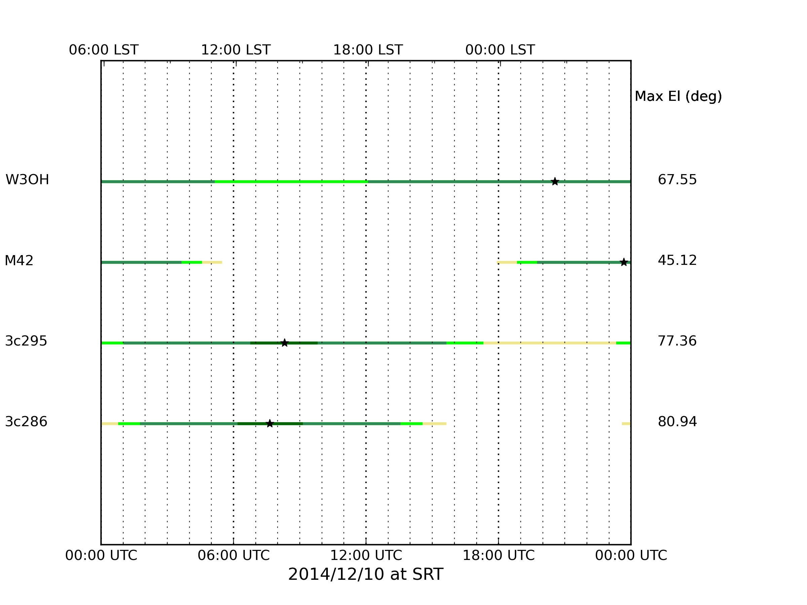
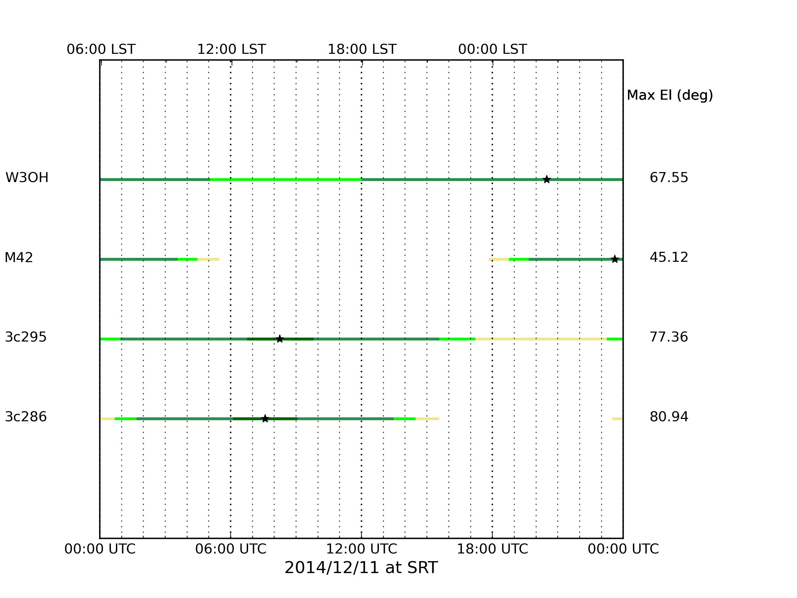
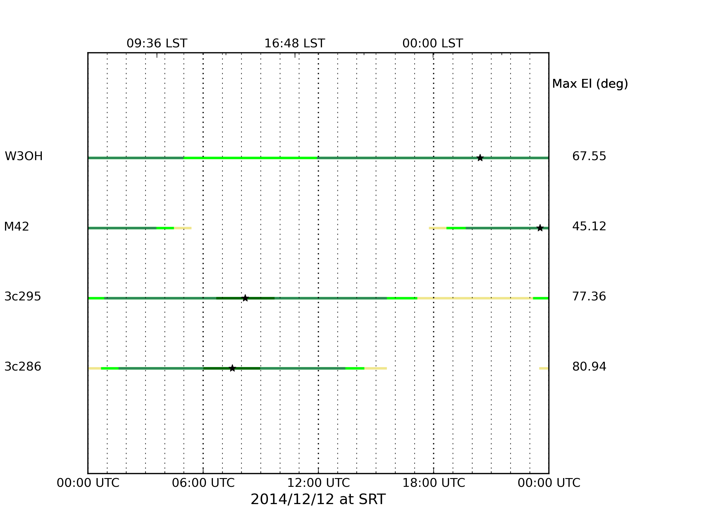

Cronoprogramma missione
~~~~~~~~~~~~~~~~~~~~~~~

Cerco di mettere per iscritto le attività da completare nella prossima missione,
più che altro per condividere gli obiettivi con tutte le persone coinvolte e
cercare di non perdersi niente per strada. Chiaramente tutto è suscettibile a
cambiamenti in relazione allo svolgersi delle attività!

10 Dicembre 2014
================

.. note:: **Tempo allocato** : 11:00 -> 17:00

Installazione
-------------

Le attività da fare sono: 

  * Installazione nuovo spettrometro su ROACH1 
  * Installazione software di controllo e postprocessing su macchina Dorian
  * Analisi dell'interfaccia con i metadati del telescopio
  * Installazione dello storage portatile USB per l'archivio dei dati della
    missione

Prima Calibrazione
------------------

Una volta installato lo spettrometro possiamo passare alla caratterizzazione e
al setup:

  * Setup banda C con filtro del focus selector a 700MHz
  * Antenna allo zenith e prime prove di acquisizione e settaggio dei livelli
  * Setup banda K con filtro del focus selector a 700MHz
  * Antenna allo zenith e prime prove di acquisizione e settaggio dei livelli
  * Osservazione dei calibratori 3c286 e 3c295 in entrambe le bande
  * Osservazione cielo vuoto con antenna in track
  * Osservazione cielo vuoto con antenna in track utilizzando la marca di
    calibrazione accesa
  * Test dei tempi di integrazione da 5ms a 5sec.
  * Gli stessi test andrebbero ripetuti con le configurazioni a 32, 1024 e 4096
    canali. Prioritario comunque 4096.

Visibilità sorgenti
-------------------

11 Dicembre 2014
================

.. note:: **Tempo allocato** : 08:00 -> 17:00

Osservazione di RFI note
------------------------

Francesco Gaudiomonte e Giampaolo Serra forniranno una serie di riferimenti
riguardo sorgenti a loro note di interferenze radio, partiremo dall'indagine in
banda C per poi muoverci possibilmente in banda K, per ogni RFI sarà necessario
conoscere esattamente la frequenza attesa e la direzione di puntamento in Az ed
EL. 

Per ogni RFI vorremmo: 

  * osservare prima un calibratore noto
  * osservare l'RFI a diverse risoluzioni temporali
  * osservare l'RFI a diverse risoluzioni frequenziali
  * compiere tutte le osservazioni in parallelo al sistema di acquisizione del
    gruppo RFI in modo da poter validare i dati e confrontarli

Calibratori di riga
-------------------

Osservazioni di W3OH e M42 sia in banda C sia in banda K a varie risoluzioni sia
temporali sia frequenziali. Anche qui intervalliamo ogni tanto con dei
calibratori. 

.. warning:: dobbiamo identificare precisamente le frequenze a cui svolgere queste 
             osservazioni

Visibilità sorgenti
-------------------

12 Dicembre 2014
================

.. note:: **Tempo allocato** : 08:00 -> 17:00

Terminiamo le attività previste, non dubito che sarà una giornata piena anche
solo per concludere quello che non siamo riusciti a fissare nei giorni
precedenti.

Visibilità sorgenti
-------------------

Altre attività
==============

Cose da fare senza un particolare ordine

Osservazione di calibratori
---------------------------

Dovrebbe venire da sè data la sopracitata modalità ma bisogna che ci ricordiamo
di compiere osservazioni degli stessi calibratori astronomici varie volte al
giorno, tutti i giorni.

Una osservazione lunga
----------------------

Tra gli obiettivi c'è anche quello di realizzare un dataset unico di una
osservazione di durata >= 30' . Possiamo farlo in qualsiasi situazione. 

Confronto su algoritmi e metodi
-------------------------------

Sarebbe molto utile riuscire a ritagliarsi uno spazio con Francesco e Giampaolo
che ci possano mostrare e descrivere un po' nel pratico gli algoritmi di
detection che stanno usando e sperimentando.

Confronto su interfaccia verso file .fits
-----------------------------------------

Se ci fosse Marco Buttu penso che assieme a Federico potrebbero ragionare su
come realizzare l'interfaccia del software DW verso i file fits in lettura e
scrittura, cercando anche di definire una tempistica il più possibile
realistica.

Visita
------
Matteo e Federico non hanno mai visto SRT ... sarebbe possibile organizzare una
visita di qualche tipo magari anche in antenna, non so una mezz'ora a cavallo
del pranzo del giovedì o venerdì?

